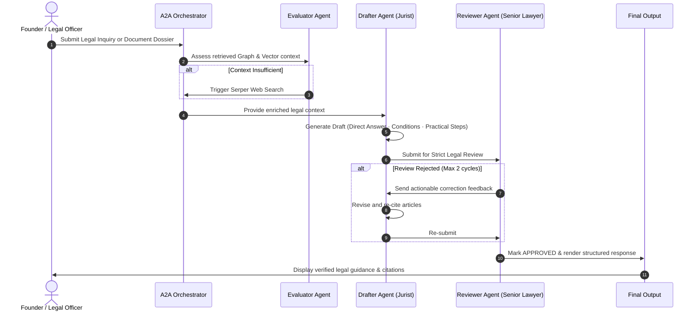

<div align="center">

# ⚡ NEXAURA PLATFORM
### *The Autonomous AI Operating System for Tunisian Startups & Venture Compliance*

[](https://opensource.org/licenses/MIT)
[](https://www.python.org/)
[](https://nextjs.org/)
[](https://react.dev/)
[](https://www.djangoproject.com/)
[](https://neo4j.com/)
[](https://qdrant.tech/)
[](https://www.docker.com/)

<p align="center">
  <a href="#-overview">Overview</a> •
  <a href="#-core-pillars">Core Pillars</a> •
  <a href="#-system-architecture">Architecture</a> •
  <a href="#-interactive-modules">Modules</a> •
  <a href="#-quick-start">Quick Start</a> •
  <a href="#-service-topology--ports">Port Matrix</a> •
  <a href="#-api-reference">API Reference</a> •
  <a href="#-test-guide">Testing</a> •
  <a href="#-roadmap">Roadmap</a>
</p>

---

</div>

## 🌟 Overview

**Nexaura** is an enterprise-grade, multi-agent AI copilot engineered specifically for the Tunisian startup and venture ecosystem. Navigating the regulatory landscape (**Startup Act Law No. 2018-20**, BCT foreign exchange circulars, INPDP data privacy regulations, and Commercial Companies Code) is often slow, fragmented, and prone to costly compliance errors.

Nexaura bridges this gap by unifying **Autonomous Legal Intelligence**, **AI-Powered Technical Advisory**, **ESG & Green Compliance Auditing**, and **Cognitive Talent Acquisition (TeamBuilder)** into a single, cohesive, high-performance platform.

```
                                  ┌────────────────────────┐
                                  │   NEXAURA PLATFORM     │
                                  │  Startup Intelligence  │
                                  └───────────┬────────────┘
                                              │
         ┌───────────────────┬────────────────┴────────────────┬───────────────────┐
         ▼                   ▼                                 ▼                   ▼
 🛡️ ComplianceGuard    👥 TeamBuilder                    🌿 Green & ESG       ⚡ Tech Advisor
   • GraphRAG (Neo4j)   • CV Ingestion & Parsing (OCR)    • ESG Scoring       • Stack Analysis
   • CRAG Verification  • Vector Candidate Matching      • Carbon Audit      • Scalability Map
   • RLM Big-Doc REPL   • LangGraph Team Assembly         • Green Labels      • Architecture AI
   • A2A Legal Drafter  • Gmail OAuth Outreach Engine     • Circular Economy  • Port 8005 API
```

---

## 💎 Core Pillars

<table>
  <tr>
    <td width="50%">
      <h3>🛡️ ComplianceGuard (Legal AI)</h3>
      <ul>
        <li><b>GraphRAG Relational Search:</b> Dual retrieval traversing Neo4j knowledge graphs and Qdrant vector spaces across 60+ Tunisian legal texts.</li>
        <li><b>CRAG (Corrective RAG):</b> Algorithmic triangulation (30% Semantic, 40% Graph Veracity, 30% Web Freshness) with knowledge-strip refinement.</li>
        <li><b>RLM (Recursive Language Model):</b> Sandboxed Python REPL execution loop bypassing LLM context window limits for massive legal dossiers.</li>
        <li><b>Agent-to-Agent (A2A) Review:</b> Multi-agent validation loop between <i>Evaluator</i>, <i>Drafter</i>, and <i>Senior Lawyer Reviewer</i>.</li>
        <li><b>Regulatory Watchdog (Veille):</b> Real-time scraping and SHA-256 diff detection on official government portals (<code>startup.gov.tn</code>, <code>bct.gov.tn</code>, <code>apii.tn</code>).</li>
      </ul>
    </td>
    <td width="50%">
      <h3>👥 TeamBuilder (AI Talent Engine)</h3>
      <ul>
        <li><b>Multimodal CV Ingestion:</b> Automatic parsing and structured extraction from PDF, DOCX, and scanned image resumes.</li>
        <li><b>Semantic Candidate Pool:</b> ChromaDB vector indexing paired with PostgreSQL relational profiles and availability tracking.</li>
        <li><b>LangGraph AI Recruiter:</b> Conversational agent for team composition, salary benchmarks, and role-candidate matching.</li>
        <li><b>Automated Outreach:</b> Direct recruitment email generation and dispatch via integrated Google OAuth & Gmail API.</li>
        <li><b>HR Analytics:</b> Real-time pipeline visualizer, acceptance ratios, and skill density distribution charts.</li>
      </ul>
    </td>
  </tr>
  <tr>
    <td width="50%">
      <h3>🌿 Green & ESG Analytics</h3>
      <ul>
        <li><b>Eco-Compliance Scoring:</b> Quantitative assessment of environmental, social, and governance compliance for green venture capital.</li>
        <li><b>Sustainable Innovation Audit:</b> Evaluates alignment with ecological standards and green startup subsidies.</li>
        <li><b>Actionable Sustainability Roadmap:</b> Step-by-step remediation plans to achieve national and international green certifications.</li>
      </ul>
    </td>
    <td width="50%">
      <h3>⚡ Technical Advisor Agent</h3>
      <ul>
        <li><b>Architectural Diagnostics:</b> Microservices vs. monolith trade-off assessment tailored to startup stage and budget.</li>
        <li><b>Tech Stack Optimization:</b> Automated evaluation of database, backend, frontend, and cloud hosting infrastructure.</li>
        <li><b>Scalability & Security Roadmap:</b> Hardening guidelines for GDPR/INPDP data isolation, API rate limiting, and CI/CD automation.</li>
      </ul>
    </td>
  </tr>
</table>

---

## 🏗️ System Architecture

Nexaura is engineered as a decoupled, microservices-oriented distributed system.

```mermaid
flowchart TB
    subgraph ClientLayer["🎨 User Interface Layer (Port 3000)"]
        UI["Next.js 16 App Router\n(React 19 · TailwindCSS 4 · Radix UI · xyflow)"]
        Sidebar["Interactive Sidebar Navigation\n(Studio · Audit · Market · Green · Tech · Documents · Chat · Veille · TeamBuilder)"]
        UI --> Sidebar
    end

    subgraph GatewayRouting["🌐 API Routing & Security"]
        HTTP8000["ComplianceGuard & Studio API\n(Django REST - :8000)"]
        HTTP8001["TeamBuilder Engine API\n(Django REST - :8001)"]
        HTTP8005["Technical Advisor API\n(FastAPI - :8005)"]
    end

    UI -->|"Compliance & Studio Requests"| HTTP8000
    UI -->|"Recruitment & HR Requests"| HTTP8001
    UI -->|"Tech Advisory Requests"| HTTP8005

    subgraph LegalHemisphere["🛡️ ComplianceGuard Core Engine"]
        GRAG["GraphRAG Hybrid Retriever"]
        CRAG_PIPE["CRAG Triangulation & Grading"]
        RLM_SANDBOX["RLM Recursive Python REPL"]
        A2A_GRAPH["A2A Multi-Agent Orchestrator\n(Evaluator ➔ Drafter ➔ Reviewer)"]
        WATCHDOG["Veille Web Watchdog\n(Scraper + SHA-256 Hashing)"]
        DOC_GEN["Agent Rédacteur\n(Statuts · CGU · Label · Contrats)"]

        HTTP8000 --> GRAG
        HTTP8000 --> CRAG_PIPE
        HTTP8000 --> RLM_SANDBOX
        HTTP8000 --> A2A_GRAPH
        HTTP8000 --> WATCHDOG
        HTTP8000 --> DOC_GEN
    end

    subgraph TeamBuilderHemisphere["👥 TeamBuilder Core Engine"]
        CV_PARSER["CV Parser & OCR (Unstructured / LLM)"]
        LG_AGENT["LangGraph Team Assembly Agent"]
        SALARY_DB["Salary Intelligence Engine"]
        GMAIL_AUTH["Google OAuth2 & Gmail Dispatcher"]

        HTTP8001 --> CV_PARSER
        HTTP8001 --> LG_AGENT
        HTTP8001 --> SALARY_DB
        HTTP8001 --> GMAIL_AUTH
    end

    subgraph DataStorageLayer["🗄️ Storage & Vector Engines"]
        NEO4J[("Neo4j 5.15\n(Legal Knowledge Graph)\n:7474 / :7687")]
        QDRANT[("Qdrant Vector DB\n(Legal & User Embeddings)\n:6333")]
        POSTGRES[("PostgreSQL 16\n(TeamBuilder Candidates & Jobs)\n:5433")]
        REDIS[("Redis 7\n(State Caching & Queues)\n:6380 / :6381")]
        CHROMADB[("ChromaDB\n(Candidate Resume Vectors)")]
        SQLITE[("SQLite / Checkpoints\n(Session State)")]

        GRAG <--> NEO4J
        GRAG <--> QDRANT
        CRAG_PIPE <--> QDRANT
        LG_AGENT <--> CHROMADB
        CV_PARSER --> POSTGRES
        SALARY_DB <--> POSTGRES
        HTTP8001 <--> REDIS
        HTTP8005 <--> REDIS
    end

    subgraph AIProviders["🧠 Inference & Embedding Layer"]
        OLLAMA["Ollama Local Engine\n(qwen3-embedding:0.6b · llama3.1 · llama3.2)\n:11434"]
        GROQ["Groq Cloud\n(Llama-3.3-70B · Llama-4-Scout)"]
        AZURE["Azure OpenAI\n(GPT-4o · Resilient Fallback)"]
        SERPER["Google Serper API\n(Live Legal Web Search)"]

        GRAG <--> OLLAMA
        CRAG_PIPE <--> SERPER
        RLM_SANDBOX <--> GROQ
        RLM_SANDBOX <--> AZURE
        A2A_GRAPH <--> GROQ
        LG_AGENT <--> GROQ
    end
```



---

## 🔍 Deep-Dive: The Multi-Agent Intelligence Engines

### 1. Dual-Hemisphere ComplianceGuard Engine

ComplianceGuard is split into two synchronized functional hemispheres:

```
┌─────────────────────────────────────────┐       ┌─────────────────────────────────────────┐
│     HEMISPHERE A: DEEP LEGAL REASONING  │       │   HEMISPHERE B: COMPLIANCE & EXECUTION  │
├─────────────────────────────────────────┤       ├─────────────────────────────────────────┤
│ • GraphRAG: Multi-hop graph traversal   │  ───► │ • Triangulation Compliance Scoring (0-100)│
│ • CRAG: Mathematical veracity grading   │       │ • A2A Multi-Agent Drafting Loop         │
│ • RLM: 10-cycle sandboxed REPL analysis │       │ • Regulatory Watchdog (SHA-256 Diffs)   │
│ • Hybrid fallback to live Serper Search │       │ • Legal Contract & Label Generator      │
└─────────────────────────────────────────┘       └─────────────────────────────────────────┘
```

#### A. Algorithmic Triangulation Scoring Formula (CRAG)
Retrieved legal documents undergo deterministic evaluation prior to synthesis:

$$\text{Score} = 0.30 \cdot \mathcal{S}_{\text{semantic}} + 0.40 \cdot \mathcal{V}_{\text{graph\_veracity}} + 0.30 \cdot \mathcal{F}_{\text{web\_freshness}}$$

- $\mathcal{S}_{\text{semantic}}$: Cosine similarity vector distance between query and legal chunk.
- $\mathcal{V}_{\text{graph\_veracity}}$: Existence check of cited legal articles as valid nodes in Neo4j.
- $\mathcal{F}_{\text{web\_freshness}}$: Verification against live official Gazette circulars via Serper search.

$$\text{Strategy} = \begin{cases} 
\text{Use Direct Documents} & \text{if Score } \ge 0.6 \\ 
\text{Live Web Search Fallback} & \text{if Score } < -0.2 \\ 
\text{Combine Internal + Web Context} & \text{otherwise} 
\end{cases}$$

#### B. Recursive Language Model (RLM)
When analyzing massive multi-hundred-page company bylaws or investment prospectuses, RLM offloads document text to a sandboxed Python REPL. The LLM generates code queries to parse, aggregate, and inspect sections dynamically across up to 10 recursive loops without overflowing context tokens.

#### C. Agent-to-Agent (A2A) Validation Loop



---

### 2. TeamBuilder AI Recruitment Engine

TeamBuilder transforms unstructured hiring into an automated, quantitative recruitment workflow:

1. **Resume Processing:** Upload PDF/DOCX/Images $\rightarrow$ Multimodal OCR & structured JSON conversion (Skills, Experience, Education, Contact).
2. **Vector Indexing:** Candidate profiles embedded into ChromaDB with metadata filters (Seniority, Salary Expectation, Availability).
3. **LangGraph Team Assembly:** State-machine agent analyzes project briefs, computes optimal role allocations, and queries candidate pools for highest skill match.
4. **Automated Outreach:** Generates personalized offer/interview letters and sends them through authenticated Google OAuth Gmail API.

---

## 🖥️ Interactive Modules

| Section | Icon | Path / Port | Primary Capability |
|---|:---:|:---:|---|
| **Studio Startup** | 🎛️ | `/` (`:3000`) | Unified executive dashboard combining Legal, Market, Green, and Tech scores. |
| **Audit Juridique** | 🛡️ | `/audit` (`:8000`) | Weighted compliance audit across 5 legal axes with real-time gauge scoring. |
| **Chat Juridique** | 💬 | `/chat` (`:8000`) | Conversational GraphRAG/CRAG assistant with PDF upload and article citations. |
| **Documents** | 📝 | `/documents` (`:8000`) | Generation of company statutes (SUARL/SARL/SA), CGU, and investment pacts. |
| **Quiz Conformité** | 🧠 | `/quiz` (`:3000`) | 22-question self-diagnostic test across 9 regulatory domains. |
| **Veille Légale** | 📡 | `/veille` (`:8000`) | Automated watcher monitoring regulatory updates on Tunisian official portals. |
| **Graphe de Lois** | 🔗 | `/graph` (`:8000`) | Interactive ReactFlow/xyflow visualization of the Neo4j legal ontology. |
| **Analyse Marché** | 📈 | `/marketing` (`:8000`) | Market sizing (TAM/SAM/SOM), competitor matrices, and growth trajectories. |
| **Analyse Verte** | 🌿 | `/green` (`:8000`) | ESG diagnostic scoring and sustainability compliance for green startups. |
| **Tech Advisor** | ⚡ | `/tech-agent` (`:8005`) | Architectural recommendations, tech stack validation, and scaling roadmaps. |
| **TeamBuilder Dashboard** | 📊 | `/tb-dashboard` (`:8001`) | HR metrics, pipeline statuses, acceptance velocity, and candidate rosters. |
| **TB AI Assistant** | 🤖 | `/tb-ai` (`:8001`) | Conversational recruiter for team composition and salary benchmarks. |
| **TB Upload CVs** | 📤 | `/tb-upload` (`:8001`) | Drag-and-drop batch resume parser with OCR and entity extraction. |
| **TB Candidates** | 👥 | `/tb-candidates` (`:8001`) | Searchable candidate pool with vector filtering and direct email outreach. |

---

## 📚 Integrated Tunisian Legal Corpus

Nexaura comes pre-indexed with comprehensive official legal texts:

| Legal Reference | Official Title | Scope & Coverage |
|---|---|---|
| **Loi n° 2018-20** | *Startup Act* | Startup Label, tax exemptions (IS 4 years), founder leave, tech card. |
| **Décret n° 2018-840** | *Décret d'application Startup Act* | Label qualification conditions, College of Startups procedures. |
| **Circulaire BCT 2019-01** | *Circulaire Banque Centrale de Tunisie* | Special foreign currency accounts for labeled startups. |
| **Circulaire BCT 2019-02** | *Carte Technologique Internationale* | International payment quota limits, digital service purchases. |
| **Code des Sociétés** | *Code des Sociétés Commerciales* | SUARL, SARL, SA, minimum capital rules, statutory requirements. |
| **Loi n° 2004-63** | *Protection des Données Personnelles* | INPDP compliance, privacy notices, user consent, biometric data. |
| **Loi n° 2000-83** | *Échanges et Commerce Électronique* | E-commerce obligations, electronic contracts, digital signatures. |
| **Loi n° 2016-71** | *Loi sur l'Investissement* | APII incentives, regional development funds, foreign investment. |
| **Code du Travail** | *Code du Travail Tunisien* | Employment contracts (CDI, CDD, SIVP), termination, social security (CNSS). |
| **Code Fiscal 2023** | *Droits et Procédures Fiscaux* | Corporate tax declarations, VAT withholding, fiscal audit preparation. |

---

## 🌐 Service Topology & Ports

| Service | Container / Process | Host Port | Internal Port | Protocol | Purpose |
|---|---|:---:|:---:|:---:|---|
| **Frontend UI** | `nextjs-app` | **`3000`** | `3000` | HTTP | Next.js 16 Unified User Interface |
| **ComplianceGuard API** | `startify-backend` | **`8000`** | `8000` | HTTP | Django REST Core Backend & RAG API |
| **TeamBuilder API** | `teambuilder-backend` | **`8001`** | `8000` | HTTP | TeamBuilder LangGraph & HR Backend |
| **Tech Advisor API** | `tech-agent-api` | **`8005`** | `8000` | HTTP | FastAPI Technical Advisor Microservice |
| **Neo4j Browser** | `startify-neo4j` | **`7474`** | `7474` | HTTP | Knowledge Graph Visual Web Console |
| **Neo4j Bolt** | `startify-neo4j` | **`7687`** | `7687` | Bolt | Binary Graph Query Connection |
| **Qdrant Vector DB** | `startify-qdrant` | **`6333`** | `6333` | HTTP | ComplianceGuard Vector Collections |
| **PostgreSQL (TeamBuilder)** | `teambuilder-postgres` | **`5433`** | `5432` | TCP | Relational Candidate & Job Store |
| **Redis (TeamBuilder)** | `teambuilder-redis` | **`6380`** | `6379` | TCP | Caching & Async Task Broker |
| **Redis (Tech Agent)** | `tech-agent-redis` | **`6381`** | `6379` | TCP | Isolated Tech Agent Cache Store |
| **Qdrant (Tech Agent)** | `tech-agent-qdrant` | **`6335`** | `6333` | HTTP | Isolated Tech Agent Vector Store |
| **Langfuse (Optional)** | `langfuse` | **`3001`** | `3000` | HTTP | LLM Observability & Trace Analytics |

---

## 🚀 Quick Start

### 📋 Prerequisites

- **Python 3.12+** (with `pip` and `virtualenv`)
- **Node.js 18+** / **npm 9+**
- **Docker Desktop** (running with Compose v2)
- **[Ollama](https://ollama.com/download)** installed locally
- API Keys: **Groq API Key**, **Google Serper API Key**, and optional **Azure OpenAI** / **Google OAuth Client ID**

---

### Step 1: Clone the Repository

```bash
git clone https://github.com/Roua-Khalfet/Compliance-Startup.git
cd Compliance-Startup
```

---

### Step 2: Provision Local Databases (Docker)

```bash
# 1. Start ComplianceGuard Data Stack (Neo4j + Qdrant)
powershell -ExecutionPolicy Bypass -File .\scripts\start-local-stack.ps1

# 2. Start TeamBuilder Data Stack (PostgreSQL + Redis)
cd backend/teambuilder
docker compose up -d
cd ../..

# 3. (Optional) Start Tech Advisor Data Stack (Redis + Qdrant)
cd backend/tech-agent
docker compose up -d
cd ../..
```

---

### Step 3: Configure Environment Variables

Create the `.env` files from templates:

```bash
# Root environment (ComplianceGuard & Studio)
cp .env.example .env

# TeamBuilder environment
cp backend/teambuilder/.env.example backend/teambuilder/.env

# Frontend environment
cp frontend/.env.example frontend/.env.local
```

> [!TIP]
> Ensure you update your `GROQ_API_KEY`, `SERPER_API_KEY`, and `GOOGLE_CLIENT_ID` / `GOOGLE_CLIENT_SECRET` in both root and `backend/teambuilder/.env`.

---

### Step 4: Pull Local AI Models (Ollama)

```bash
# High-performance multilingual embedding model
ollama pull qwen3-embedding:0.6b

# Local inference models
ollama pull llama3.2
ollama pull llama3.1
```

---

### Step 5: Setup Python Virtual Environment & Migrations

```bash
# Create and activate Python virtualenv
python -m venv .venv
# Windows:
.venv\Scripts\activate
# Linux/macOS:
source .venv/bin/activate

# Install root dependencies
pip install -r requirements.txt

# Run ComplianceGuard migrations
cd backend
python manage.py migrate
cd ..

# Run TeamBuilder migrations
cd backend/teambuilder
python manage.py migrate
cd ../..
```

---

### Step 6: Ingest Legal Corpus (First-Time Setup)

To build the Neo4j Knowledge Graph and vectorize the legal chunks into Qdrant:

```bash
python complianceguard/ingest.py
```

---

### Step 7: Launch All Services

Launch each service in a dedicated terminal window:

<details open>
<summary><b>💻 Terminal 1 — ComplianceGuard & Studio Backend (Port 8000)</b></summary>

```bash
cd backend
python manage.py runserver 0.0.0.0:8000
```
</details>

<details open>
<summary><b>👥 Terminal 2 — TeamBuilder Backend (Port 8001)</b></summary>

```bash
cd backend/teambuilder
python manage.py runserver 0.0.0.0:8001
```
</details>

<details>
<summary><b>⚡ Terminal 3 — Technical Advisor Agent Backend (Port 8005 - Optional)</b></summary>

```bash
cd backend/tech-agent
uvicorn technical_advisor_agent.main:app --host 0.0.0.0 --port 8005 --reload
```
</details>

<details open>
<summary><b>🎨 Terminal 4 — Next.js Frontend (Port 3000)</b></summary>

```bash
cd frontend
npm install
npm run dev
```
</details>

Open your browser at **[http://localhost:3000](http://localhost:3000)** to access the Nexaura workspace.

---

## 🔌 API Reference

### ComplianceGuard & Studio Endpoints (`http://localhost:8000`)

| Method | Endpoint | Description | Request Body Example |
|---|---|---|---|
| `POST` | `/api/chat/` | Query GraphRAG (`mode: "kb"`) or CRAG (`mode: "notebook"`) | `{"message": "Avantages fiscaux Startup Act ?", "mode": "kb"}` |
| `POST` | `/api/upload/` | Ingest user PDF into isolated Qdrant collection | `multipart/form-data; file=@document.pdf` |
| `POST` | `/api/conformite/` | Comprehensive legal scoring on 5 regulatory criteria | `{"nom": "NexPay", "secteur": "Fintech", "capital": 50000, "description": "..."}` |
| `POST` | `/api/documents/` | Generate ready-to-sign legal contract or bylaws | `{"type_doc": "statuts", "forme_juridique": "SUARL", "capital": 5000, ...}` |
| `GET` | `/api/graph/` | Retrieve nodes and links for Neo4j ReactFlow visualizer | `None` |
| `GET` | `/api/veille/` | Check status of government portal scrapers and hash diffs | `None` |
| `POST` | `/api/suggestions/` | Get context-aware legal questions by startup sector | `{"secteur": "HealthTech"}` |

### TeamBuilder Endpoints (`http://localhost:8001`)

| Method | Endpoint | Description | Request Body Example |
|---|---|---|---|
| `GET` | `/api/v1/stats` | Retrieve aggregate candidate count, job openings, and email stats | `None` |
| `POST` | `/api/v1/hr/upload-cv` | Parse and vectorize uploaded resume file | `multipart/form-data; file=@resume.pdf` |
| `GET` | `/api/v1/hr/candidates` | List and filter candidate pool by seniority, skill, status | Query params: `?skill=Python&seniority=Senior` |
| `POST` | `/api/v1/team-builder` | LangGraph multi-step team assembly workflow | `{"prompt": "Build a seed-stage team for an AI healthtech startup"}` |
| `POST` | `/api/v1/send-invitation`| Dispatch interview invitation email via Google OAuth | `{"candidate_id": 42, "subject": "Interview", "body": "..."}` |

---

## 🧪 Test Guide & Scenario Validation

Validate platform intelligence using the following benchmark test cases:

```
┌────────────────────────────────────────────────────────────────────────────────────────┐
│ TEST SCENARIO A: Legal Compliance Scoring (Fintech Alert)                             │
├────────────────────────────────────────────────────────────────────────────────────────┤
│ • Input: Nom="PayDinar", Secteur="Fintech", Description="Mobile wallet & P2P payments"│
│ • Expected Result: Score ~40-50% with explicit flag: "BCT Authorization Required"     │
│ • Legal Citation: Loi n° 2016-48 & Circulaire BCT 2020-01                             │
└────────────────────────────────────────────────────────────────────────────────────────┘
```

```
┌────────────────────────────────────────────────────────────────────────────────────────┐
│ TEST SCENARIO B: Document Generation (Company Statutes)                                │
├────────────────────────────────────────────────────────────────────────────────────────┤
│ • Input: Type="statuts", Forme="SUARL", Nom="NexInnovate", Capital=5000, Activité="SaaS"│
│ • Expected Result: Generated markdown with Startup Act Art. 13 clauses and CSC format   │
└────────────────────────────────────────────────────────────────────────────────────────┘
```

```
┌────────────────────────────────────────────────────────────────────────────────────────┐
│ TEST SCENARIO C: Corrective RAG (CRAG) Document Interrogation                          │
├────────────────────────────────────────────────────────────────────────────────────────┤
│ • Action: Upload a custom NDA or investment term sheet PDF in Notebook mode            │
│ • Query: "Quelles sont les clauses de non-concurrence et pénalités applicables ?"      │
│ • Expected Result: Verifiable extraction from the user's PDF with strip citations      │
└────────────────────────────────────────────────────────────────────────────────────────┘
```

---

## 🗺️ Roadmap & Milestones

- [x] **Phase 1: Knowledge Graph & Hybrid RAG Engine**
  - Ingestion pipeline for 12+ primary Tunisian legal codes.
  - Neo4j graph entity linking and Qdrant vector retrieval.
- [x] **Phase 2: Corrective RAG (CRAG) & RLM Sandbox**
  - Algorithmic triangulation scoring formula.
  - REPL code execution for big-document parsing.
- [x] **Phase 3: Multi-Agent Orchestration & TeamBuilder Integration**
  - A2A Drafter-Reviewer loop with strict legal approval rules.
  - Integration of TeamBuilder recruitment microservice.
  - Multi-dimensional Studio Pipeline (Legal, Market, Green, Tech).
- [ ] **Phase 4: Ecosystem Expansion (In Progress)**
  - [ ] Automated e-filing direct integration with the *Guichet Unique APII*.
  - [ ] Fine-tuned Tunisian Dialect (Derja) legal assistant module.
  - [ ] Multi-tenant organization accounts with role-based access control (RBAC).

---

## 🛠️ Tech Stack Matrix

```
   FRONTEND                    BACKEND SERVICES             DATA & EMBEDDINGS           AI & ORCHESTRATION
┌────────────────────┐      ┌────────────────────┐       ┌────────────────────┐      ┌────────────────────┐
│ • Next.js 16 (App) │      │ • Django 5.0 REST  │       │ • Neo4j 5.15 Aura  │      │ • LangChain        │
│ • React 19         │      │ • FastAPI Microsvc │       │ • Qdrant Vector DB │      │ • LangGraph        │
│ • TailwindCSS 4    │      │ • Python 3.12      │       │ • PostgreSQL 16    │      │ • Ollama Local     │
│ • Radix UI / ShadCN│      │ • Pydantic v2      │       │ • Redis 7          │      │ • Groq (Llama-3.3) │
│ • Framer Motion    │      │ • Celery / Redis   │       │ • ChromaDB         │      │ • Azure OpenAI     │
│ • xyflow (Graph)   │      │ • Unstructured     │       │ • SQLite Checkpoints│     │ • Google Serper    │
└────────────────────┘      └────────────────────┘       └────────────────────┘      └────────────────────┘
```

---

## 🤝 Contributing

Contributions are welcome! Please follow these steps:

1. **Fork the Repository**
2. **Create a Feature Branch:**
   ```bash
   git checkout -b feature/AmazingFeature
   ```
3. **Commit Your Changes:**
   ```bash
   git commit -m "feat: add support for CNSS automated declaration checklist"
   ```
4. **Push to the Branch:**
   ```bash
   git push origin feature/AmazingFeature
   ```
5. **Open a Pull Request**

---

## 📜 License

Distributed under the **MIT License**. See [`LICENSE`](LICENSE) for more information.

---

<div align="center">

**Built with pride for the Tunisian Startup Ecosystem** 🇹🇳

*Nexaura — Navigating Innovation, Automating Compliance, Empowering Founders.*

</div>
