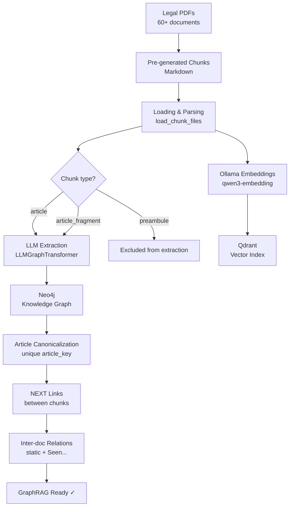
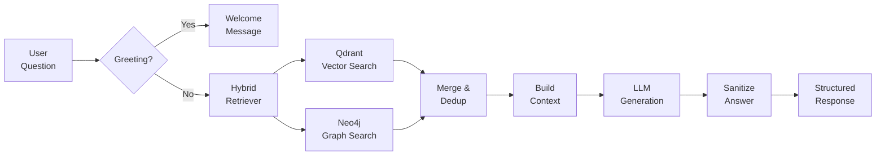
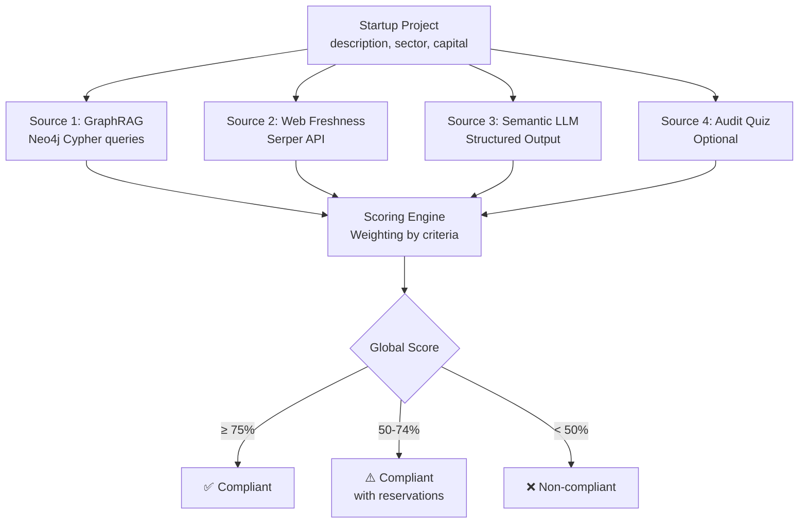

# ComplianceGuard — AI Legal Compliance Engine for Tunisian Startups

> **Version:** 1.0  
> **Authors:** Compliance-Startup Team  
> **Last Updated:** May 2026

---

## Table of Contents

1. [Overview](#1-overview)
2. [System Architecture](#2-system-architecture)
3. [Technology Stack](#3-technology-stack)
4. [Detailed Modules](#4-detailed-modules)
5. [Ingestion Pipeline (GraphRAG)](#5-ingestion-pipeline-graphrag)
6. [Question-Answering Pipeline](#6-question-answering-pipeline)
7. [Multi-Agent System (A2A / LangGraph)](#7-multi-agent-system-a2a--langgraph)
8. [CRAG — Corrective Retrieval-Augmented Generation](#8-crag--corrective-retrieval-augmented-generation)
9. [Recursive Language Model (RLM)](#9-recursive-language-model-rlm)
10. [Triangulation Compliance Scoring](#10-triangulation-compliance-scoring)
11. [Specialized Agents](#11-specialized-agents)
12. [Legal Corpus](#12-legal-corpus)
13. [Academic References](#13-academic-references)
14. [Project Structure](#14-project-structure)

---

## 1. Overview

**ComplianceGuard** is an artificial intelligence engine designed to assist Tunisian entrepreneurs with legal compliance related to the **Startup Act (Law No. 2018-20)**. It combines several advanced AI paradigms:

- **GraphRAG** (Retrieval-Augmented Generation enriched by a Knowledge Graph)
- **CRAG** (Corrective RAG with self-evaluation and web fallback)
- **RLM** (Recursive Language Model for multi-step reasoning)
- **A2A Multi-Agent Architecture** (Agent-to-Agent via LangGraph)
- **Triangulation compliance scoring** (GraphRAG × Web × LLM)

The system transforms a corpus of **60+ Tunisian legal texts** (PDFs) into an interrogatable knowledge graph, enabling precise answers with citations of legal articles.

---

## 2. System Architecture

```
┌─────────────────────────────────────────────────────────────────┐
│                        FRONTEND (Next.js)                       │
│            Chat · Compliance · Monitoring · Documents           │
└───────────────────────────┬─────────────────────────────────────┘
                            │ REST API / SSE
┌───────────────────────────▼─────────────────────────────────────┐
│                     BACKEND (Django REST)                        │
│                   api/views.py → Endpoints                      │
└───────────────────────────┬─────────────────────────────────────┘
                            │
┌───────────────────────────▼─────────────────────────────────────┐
│                   COMPLIANCEGUARD ENGINE                         │
│                                                                 │
│  ┌──────────┐  ┌──────────┐  ┌──────────┐  ┌────────────────┐  │
│  │graph_    │  │  crag.py │  │  RLM/    │  │compliance_     │  │
│  │agent.py  │  │  (CRAG)  │  │recursive_│  │scoring.py      │  │
│  │(LangGraph│  │          │  │language_ │  │(Triangulation) │  │
│  │ A2A)     │  │          │  │model.py  │  │                │  │
│  └────┬─────┘  └────┬─────┘  └────┬─────┘  └───────┬────────┘  │
│       │             │             │                 │            │
│  ┌────▼─────────────▼─────────────▼─────────────────▼────────┐  │
│  │              HYBRID RETRIEVER (retriever.py)              │  │
│  │         Vector Search (Qdrant) + Graph Search (Neo4j)     │  │
│  └────┬──────────────────────────────────────┬───────────────┘  │
│       │                                      │                  │
│  ┌────▼────────────┐                ┌────────▼───────────────┐  │
│  │   Qdrant        │                │      Neo4j (Aura)      │  │
│  │   Vector DB     │                │    Knowledge Graph     │  │
│  │                 │                │                        │  │
│  │ Chunks embeddings│               │ Law─APPLIES→Decree      │  │
│  │ (Ollama/Qwen3)  │                │ Article─PROVIDES→Benefit│ │
│  └─────────────────┘                └────────────────────────┘  │
│                                                                 │
│  ┌──────────────────────────────────────────────────────────┐   │
│  │              OLLAMA (Local Embeddings)                    │   │
│  │              qwen3-embedding:0.6b                        │   │
│  └──────────────────────────────────────────────────────────┘   │
│                                                                 │
│  ┌──────────────────────────────────────────────────────────┐   │
│  │         AZURE OPENAI / GROQ (LLM Inference)              │   │
│  │    Kimi-K2.5 · Llama-4-Scout · Llama-4-Maverick          │   │
│  └──────────────────────────────────────────────────────────┘   │
└─────────────────────────────────────────────────────────────────┘
```

---

## 3. Technology Stack

| Component | Technology | Role |
|-----------|-------------|------|
| **Knowledge Graph** | Neo4j Aura | Storage of legal entities and relations |
| **Vector Store** | Qdrant (Cloud/Local) | Semantic similarity index on chunks |
| **Embeddings** | Ollama + Qwen3-embedding (0.6b) | Local document vectorization |
| **LLM Inference** | Azure OpenAI (Kimi-K2.5) / Groq (Llama-4-Scout) | Response generation and entity extraction |
| **Orchestration** | LangChain + LangGraph | RAG chains and agent graphs |
| **RAG Framework** | LLMGraphTransformer (LangChain Experimental) | Automatic entity extraction → Neo4j |
| **Web Search** | Google Serper API + Crawl4AI | Web fallback and freshness verification |
| **Document Parsing** | Unstructured + PyPDF + PyMuPDF (fitz) | Multi-format text extraction |
| **RLM** | `rlm` (Recursive Language Model library) | Recursive reasoning via Python REPL |
| **Configuration** | Pydantic Settings + dotenv | Centralized environment variable management |

---

## 4. Detailed Modules

### 4.1 `ingest.py` — Ingestion Pipeline (1667 lines)

The core of the Knowledge Graph construction system. A 5-step pipeline:

1. **Neo4j Initialization** — Creation of uniqueness constraints (`UNIQUE` on Law.reference, Decree.reference, etc.) and lookup indexes (`Article.article_key`, `Chunk.chunk_id`).
2. **Pre-generated Chunk Loading** — Parsing of Markdown files with automatic type detection (article, preamble, fragment) and extraction of "Seen..." (Vu...) clauses for inter-document references.
3. **Legal Entity Extraction** — Via `LLMGraphTransformer` with a specialized legal prompt, followed by an **Article node canonicalization** (composite key `<reference>::article:<number>` to avoid inter-document collisions).
4. **Qdrant Vector Index** — Ollama embeddings + batch upsert (size configurable via `QDRANT_BATCH_SIZE`).
5. **Inter-document Relations** — Verified static links (5 hardcoded Startup Act relations) + dynamic links automatically extracted from the "Seen..." clauses of each text.

**Extracted Entities:** Article, Law, Decree, Circular, Organization, Benefit, Obligation, Condition, Deadline, Amount.

**Extracted Relations:** PROVIDES (PREVOIT), CONDITIONS (CONDITIONNE), CONCERNS (CONCERNE), MODIFIES (MODIFIE), APPLIES (APPLIQUE), DEPENDS_ON (DEPEND_DE), SETS (FIXE).

**Dual Qdrant Architecture:** The system maintains **two distinct collections**:
- `complianceguard_chunks` — Main legal corpus (ingested via the full pipeline).
- `user_uploads` — User-uploaded documents (ingested via `fast_ingest_file()`).

**Fast Ingestion (`fast_ingest_file`)**: Streamlined pipeline for user documents — Unstructured parsing → semantic chunking → embeddings → Qdrant upsert. Does **not** feed into Neo4j to avoid polluting the legal truth graph. Includes a complete pypdf fallback if the primary parser fails.

**Contextual Enrichment for LLM:** Before entity extraction, each chunk is enriched with its neighbors (previous/next chunk) and explicit metadata in a structured format `META / TEXT_TO_EXTRACT / CONTEXT_BEFORE / CONTEXT_AFTER`, allowing the LLM to resolve truncated sentences at chunk boundaries.

**Resilience:** Exponential retry on 429 errors (Azure rate-limit) and transient Neo4j network errors, with automatic Neo4j driver reconnection. Configurable batch size and throttling via environment variables (`GRAPH_BATCH_SIZE`, `GRAPH_BATCH_THROTTLE_SECONDS`, `GRAPH_MAX_RETRIES`).

### 4.2 `crag.py` — Corrective RAG (445 lines)

Implementation of the **CRAG (Corrective Retrieval-Augmented Generation)** paradigm:

1. **Retrieval** → Documents via hybrid retriever (`kb` or `notebook` mode).
2. **Grading** → Algorithmic triangulation scoring (fact_checker.py) — no LLM for grading.
3. **Decision** → `use_docs` | `web_search` | `combine` based on configurable thresholds.
4. **Refinement** → Decomposition into "knowledge strips" and re-scoring by LLM (`with_structured_output`).
5. **Query Rewriting** → Rewriting the question into 3 concise keywords for the web (`_rewrite_web_query`).
6. **Generation** → Final response with filtered and refined context.

The refinement process breaks each document down into 2-sentence strips (max 600 chars), scores each strip independently via LLM, and retains only relevant strips (score ≥ 0.0). The same process applies to web context (`_refine_web_context`).

**Notebook mode:** When the question targets an uploaded document, the web fallback is **disabled** and only the `user_uploads` collection is queried.

### 4.3 `graph_agent.py` — LangGraph Multi-Agent Orchestrator (327 lines)

**Agent-to-Agent (A2A)** architecture with 6 nodes:

| Node | Role |
|------|------|
| `node_crag` | Analysis of uploaded documents (notebook mode) |
| `node_graphrag` | Querying the internal knowledge base |
| `node_evaluator` | Evaluates the sufficiency of internal context |
| `node_web` | Web search if context is insufficient |
| `node_draft` | Drafting the response (Drafter Agent) |
| `node_review` | Critical proofreading (Reviewer Agent / Senior Lawyer) |

**Decision Flow:**
```
START ──┬──→ node_crag ────┬──→ node_evaluator ──┬──→ node_web ──→ node_draft ──→ node_review
        │                  │                     │                                    │
        └──→ node_graphrag ┘                     └──→ node_draft ──→ node_review     │
                                                                        ▲             │
                                                                        └─── rewrite ─┘
                                                                              (max 2x)
```

The **node_review** acts as a senior lawyer verifying the structure (3 mandatory sections) and can send the draft back for correction (maximum 2 iterations).

### 4.4 `compliance_scoring.py` — Triangulation Scoring (570 lines)

Dynamic scoring engine merging 3+1 sources:

1. **GraphRAG (Neo4j)** — Cypher queries to retrieve capital thresholds, Startup Act conditions, and sectoral obligations.
2. **Web Freshness (Serper)** — Verifies if cited laws are still in force.
3. **Semantic LLM** — Structured project analysis (innovation, payments, data, e-commerce) via `with_structured_output`.
4. **Audit Quiz** (optional) — Integration of results from an interactive compliance quiz.

**Weighted Criteria:**

| Criterion | Weight | Source |
|---------|-------|--------|
| Startup Label Eligibility | 25% | LLM + GraphRAG |
| Share Capital | 15% | GraphRAG + Fallback |
| BCT Authorizations | 20% | LLM (payment detection) |
| Data Protection (INPDP) | 15% | LLM (data sensitivity) |
| E-commerce | 10% | LLM |
| Legislative Freshness | 15% | Web (Serper) |

### 4.5 `RLM/recursive_language_model.py` — Recursive Reasoning (284 lines)

Wrapper around the **RLM (Recursive Language Model)** library for multi-document analysis.

**Key Insight:** The RLM stores document context in a Python REPL variable, not in the LLM's context window. The LLM only sees the system prompt + code outputs, bypassing Groq's context limits.

- **Primary provider:** Groq (Llama-4-Scout) — fast.
- **Automatic fallback:** Azure OpenAI (Kimi-K2.5) — in case of rate-limiting.
- **Max iterations:** 10 REPL steps per query.

### 4.6 `tools/retriever.py` — Hybrid Retriever (578 lines)

`ComplianceGuardRetriever` combines:

1. **Vector Search** — Qdrant (corpus + user uploads) with dimensional compatibility checks between the active embedding model and the existing collection.
2. **Graph Search** — Fulltext Neo4j index (`legal_entities` on Article|Law|Decree|Circular|Organization|Benefit|Obligation|Condition) + multi-hop relational traversal.
3. **Relational Fallback** — Injection of explicit `src-[REL]→tgt` paths for inter-document queries.
4. **Relation Summary** — Injection of a statistical summary of graph relations (`APPLIES(5), PROVIDES(12)...`) to help the LLM contextualize.
5. **Neo4j Enrichment** — Each vector result is enriched via a Neo4j lookup to retrieve entities linked via `MENTIONS`.

**Search Modes:**
- `all` — Corpus + User uploads + Graph (default).
- `kb` — Knowledge base only (no user uploads, active graph).
- `notebook` — Uploaded documents only (no graph, no corpus).

**Neo4j Resilience:** Retry with exponential backoff (0.8s → 4.0s) and automatic driver reconnection on transient errors (connection defunct, routing, SSL, timeout).

### 4.7 `tools/fact_checker.py` — Fact Checking (132 lines)

**Deterministic triangulation** algorithm replacing pure LLM scoring:

| Source | Weight | Method |
|--------|-------|---------|
| Semantic Relevance | 30% | Qdrant/Graph vector score |
| GraphRAG Veracity | 40% | Verification of reference existence in Neo4j |
| Web Freshness | 30% | Serper search to detect repeals |

Final score normalized to `[-1, 1]` for compatibility with the CRAG module.

### 4.8 `agent_veille.py` — Regulatory Monitoring (470 lines)

Asynchronous agent that monitors official Tunisian websites to detect regulatory changes:

- **startup.gov.tn** — Startup Act Portal
- **bct.gov.tn** — BCT Circulars
- **apii.tn** — Agency for the Promotion of Industry

Method: SHA256 hashing of normalized content, comparison with local cache, automatic Markdown change report generation.

### 4.9 `agent_redacteur.py` — Document Generation (471 lines)

Automatically generates 4 types of legal documents:
- Company **Statutes** (SUARL/SARL/SA)
- **TOS** (Terms of Service / CGU)
- **Investment Contract** (with Startup Act clauses)
- **Startup Label Application** (application form)

### 4.10 `chain.py` — Web Search Agent (284 lines)

LangChain agent with tool-calling loop:
- **serper_search** — Google Search via Serper
- **scrape_website** — Web content extraction via WebBaseLoader
- **Link validation** — HTTP verification of URLs before inclusion in the report
- **Grounding step** — Pre-searching for verified URLs (HTTP 2xx/3xx) injected into the system prompt to prevent the LLM from hallucinating links.

### 4.11 `ask_question.py` — Response Post-processing (434 lines)

Direct Q&A module with a **sanitization** pipeline for answers:
- Automatic removal of `.pdf` filenames from responses.
- Expansion of short references to their full legal form (e.g., `Law No. 2018-20` → `Law No. 2018-20 of April 17, 2018 (Startup Act)`).
- Intelligent detection of greetings and non-questions (< 3 words).
- Smart context truncation: retention of the **beginning AND end** of long chunks (operative conditions are often at the end of legal sections).

### 4.12 `document_utils.py` — Semantic Chunking (436 lines)

Document splitting engine respecting natural boundaries:
1. **By legal articles** (`Art. X`) — highest priority
2. **By chapters/titles/sections** — structural fallback
3. **By Markdown headings** — for pre-structured documents
4. **By paragraphs** — ultimate fallback with intelligent grouping

Adaptive PDF extraction: Unstructured strategy cascade (`auto` → `fast` → `hi_res` → `ocr_only`) with multilingual support (French + English).

---

## 5. Ingestion Pipeline (GraphRAG)



**Legal Extraction Prompt Details:**

The `LEGAL_ENTITY_PROMPT` enforces strict rules:
- Extract only from the `TEXT_TO_EXTRACT` section.
- Use metadata (reference, article_num) as anchors.
- Only create a Law/Decree node if the text MODIFIES or DEPENDS ON it.
- Ignore article numbers, years, page numbers for Amounts.
- Strict entity deduplication.

---

## 6. Question-Answering Pipeline



**Mandatory response structure:** Direct Answer → Main Conditions → Practical Steps.

---

## 7. Multi-Agent System (A2A / LangGraph)

The system implements an **Agent-to-Agent** architecture inspired by Google's A2A protocol, with specialized agents collaborating via a LangGraph state graph:

| Agent | Role | Personality |
|-------|------|-------------|
| **Evaluator** | Judges internal context sufficiency | Critical Analyst |
| **Drafter** | Synthesizes sources into a structured draft | Consultant Jurist |
| **Reviewer** | Validates or rejects the draft | Senior Lawyer |

**Peer-review Mechanism:**
1. The Drafter produces a draft.
2. The Reviewer checks for the presence of the 3 mandatory sections.
3. If rejected → explicit feedback → returned to the Drafter (max 2 iterations).
4. If approved → `APPROVED` → final response.

---

## 8. CRAG — Corrective Retrieval-Augmented Generation

Based on the paper **"Corrective Retrieval Augmented Generation" (Yan et al., 2024)**.

**Principle:** Rather than blindly trusting retrieved documents, CRAG evaluates their relevance and dynamically decides on a strategy:

```
Retrieved Documents
       │
       ▼
  Grading (Triangulation)
       │
       ├── Score ≥ 0.6  →  USE_DOCS (sufficient documents)
       │
       ├── Score < -0.2 →  WEB_SEARCH (irrelevant documents)
       │
       └── Else         →  COMBINE (merge docs + web)
```

**Local Innovation:** The grading does not solely use an LLM but an **algorithmic triangulation** (fact_checker.py) combining vector score, graph consistency, and web freshness.

---

## 9. Recursive Language Model (RLM)

Based on the paper **"Recursive Language Models" (Giannou et al., 2025)** — allowing the LLM to "program its own thinking" via a Python REPL.

**Application in ComplianceGuard:** Multi-document analysis of the entire Tunisian legal corpus without being limited by the LLM's context window. The RLM:
1. Loads all PDFs into Python memory.
2. Writes code to navigate, filter, and cross-reference documents.
3. Iterates recursively until a complete answer is built.

---

## 10. Triangulation Compliance Scoring



The LLM analysis uses `with_structured_output` (Pydantic) to reliably extract:
- `innovation_score` (0-100)
- `has_payment_activity` (boolean)
- `data_sensitivity` (critical/standard/minimal)
- `is_ecommerce` (boolean)
- `detected_sectors` (list)

---

## 11. Specialized Agents

### Regulatory Monitoring Agent
- Asynchronous scraping (httpx + BeautifulSoup)
- Hashing and temporal comparison
- Automatic Markdown report generation

### Drafter Agent
- Parameterized legal templates
- Optional enrichment via LLM
- Complete document pack (Statutes + TOS + Contract + Label App)

### Web Search Agent (chain.py)
- Agentic loop with tool-calling (max 15 iterations)
- Grounding via pre-validated URLs (HTTP 2xx/3xx)
- Automatic link validation in the final report

---

## 12. Legal Corpus

The system ingests and indexes the following legal texts:

| Document | Type | Domains Covered |
|----------|------|-------------------|
| **Law No. 2018-20** | Law | Startup Label, IS, leave, stipend, funding |
| **Decree No. 2018-840** | Decree | Labeling procedure, conditions, leave |
| **BCT Circular 2019-01** | Circular | FX accounts, foreign exchange, fundraising |
| **BCT Circular 2019-02** | Circular | International Tech Card, current transfers |
| **Commercial Companies Code** | Code | SARL, SA, SAS, share capital, statutes |
| **Tax Rights and Procedures Code**| Code | Corporate tax, VAT, declarations, tax audit |
| **Labor Code** | Code | Contracts, dismissal, leave, salary |
| **Law No. 2004-63** | Law | Data protection, INPDP |
| **Law No. 2016-71** | Law | Investment, APII, incentives |
| + 50 other laws/decrees | Various | Finance, commerce, labor... |

---

## 13. Academic References

| Concept | Reference |
|---------|-----------|
| **RAG** | Lewis et al., *"Retrieval-Augmented Generation for Knowledge-Intensive NLP Tasks"*, NeurIPS 2020 |
| **GraphRAG** | Microsoft Research, *"GraphRAG: Unlocking LLM Discovery on Narrative Private Data"*, 2024 |
| **CRAG** | Yan et al., *"Corrective Retrieval Augmented Generation"*, ICML 2024 |
| **RLM** | Giannou et al., *"Recursive Language Models"*, 2025 |
| **LLMGraphTransformer** | LangChain Experimental — Entity/relation extraction via LLM to graph |
| **LangGraph** | LangChain, *"LangGraph: Multi-Actor Applications with LLMs"*, 2024 |
| **A2A Protocol** | Google DeepMind, *"Agent-to-Agent Protocol"*, 2025 |
| **Knowledge Graphs for Legal AI** | Bommarito & Katz, *"A Measure of Law"*, 2024 |
| **Structured Output** | OpenAI / Pydantic — Reliable structured extraction via JSON/Pydantic schemas |
| **Hybrid Search** | Qdrant, *"Hybrid Search: Combining Dense and Sparse Retrieval"* — Vector + fulltext fusion |

---

## 14. Project Structure

```
complianceguard/
├── __init__.py
├── config.py                    # Centralized configuration (Pydantic Settings)
├── config/
│   ├── agents.yaml              # Compliance agent definition
│   └── tasks.yaml               # Research tasks description
│
├── ingest.py                    # GraphRAG ingestion pipeline (1667 lines)
├── document_utils.py            # PDF/DOCX parsing, semantic chunking
│
├── ask_question.py              # Direct Q&A (GraphRAG + web fallback)
├── crag.py                      # Corrective RAG (grading + refinement)
├── chain.py                     # Web search agent (tool-calling)
├── graph_agent.py               # LangGraph multi-agent orchestrator (A2A)
├── compliance_scoring.py        # Triangulation compliance scoring
│
├── agent_veille.py              # Regulatory monitoring (async scraping)
├── agent_redacteur.py           # Legal document generation
│
├── main.py                      # CLI entry point
├── api.py                       # API Endpoints (stub)
├── test_a2a.py                  # A2A protocol tests
│
├── RLM/
│   └── recursive_language_model.py  # RLM Wrapper (Groq/Azure)
│
├── tools/
│   ├── retriever.py             # Hybrid retriever (Qdrant + Neo4j)
│   ├── fact_checker.py          # Fact checking (triangulation)
│   ├── graph_agent.py           # LangChain Tools (RAG + Graph QA + Compliance)
│   └── custom_tool.py           # Custom tools
│
├── tests/
│   └── graphrag_suite.py        # Structural + retriever test suite (852 lines)
│
└── Data/
    ├── *.pdf                    # 60+ Tunisian legal texts
    ├── chunks/                  # Pre-generated chunks (Markdown)
    ├── chunks_hybrid/           # Hybrid chunks
    ├── graph_export/            # Neo4j graph exports
    └── backup/                  # Backups
```

---

## Main Environment Variables

```env
# Neo4j
NEO4J_URI=neo4j+s://xxx.databases.neo4j.io
NEO4J_USERNAME=neo4j
NEO4J_PASSWORD=***

# Qdrant
QDRANT_URL=https://xxx.qdrant.io
QDRANT_API_KEY=***
QDRANT_COLLECTION_NAME=complianceguard_chunks

# Ollama (Local Embeddings)
OLLAMA_BASE_URL=http://localhost:11434
OLLAMA_EMBED_MODEL=qwen3-embedding:0.6b

# Azure OpenAI (Primary LLM)
AZURE_API_BASE=https://xxx.services.ai.azure.com
AZURE_API_KEY=***
AZURE_MODEL=Kimi-K2.5

# Groq (Secondary LLM / RLM)
GROQ_API_KEY=***
GROQ_MODEL=meta-llama/llama-4-scout-17b-16e-instruct

# Serper (Web Search)
SERPER_API_KEY=***
```

---

> **Note:** This document is generated to serve as a technical reference for a project report. For any questions regarding the implementation, refer directly to the documented source code.
